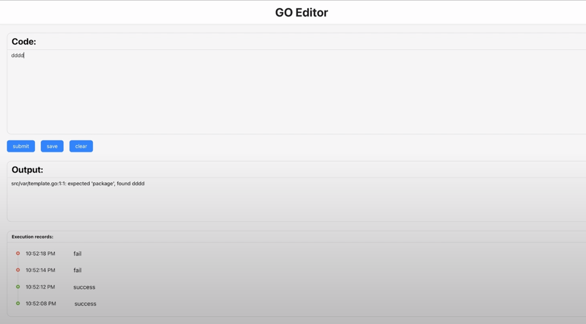
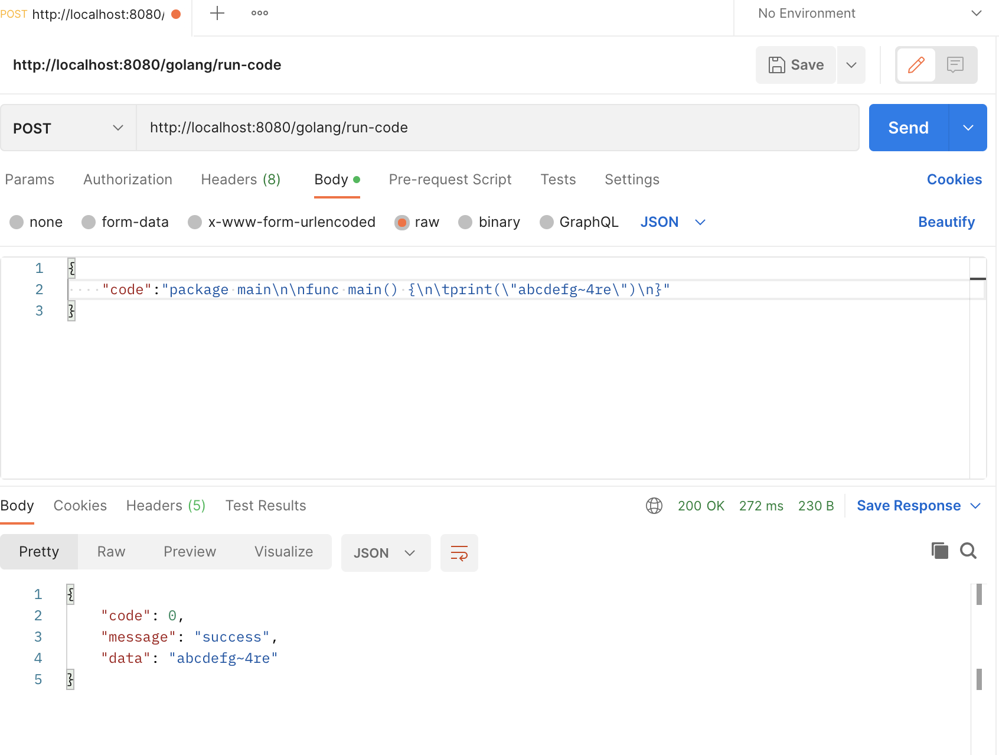

# GoEditor

## features:
- Online go editor for the single file Golang program
- You can submit, save, clear your code snippets
- There is a list for recording the latest 5 results and corresponding time of each execution in reverse order
- You can see the result for your code for both cases in success or failure

## display


- `submit` button: submit your code snippet to the backend api
- `save` button: save your code, you can keep your code even if you refresh your browser
- `clear` button: clear your code, you can clear your code
##  deployment

### method1:
- run backend part locally:

```shell
# go to dir and run
cd backend
go run main.go
```


the backend server will run on: http://localhost:8080
- run frontend part locally:
```shell
# go to dir and run
cd frontend
npm install
npm start
```

Then you can access GoEditor at: http://localhost:3000/

### method2: (recommended)
- run locally by using docker
```shell
# get latest image from docker hub
docker pull hsbzzhz/go-editor:latest
docker run -it -d --name go-editor -p 9090:8080 hsbzzhz/go-editor
```
**p.s. don't try to run docker file locally unless you have prepared compiled file in `/static`**

Then you can access GoEditor at: http://localhost:9090/
