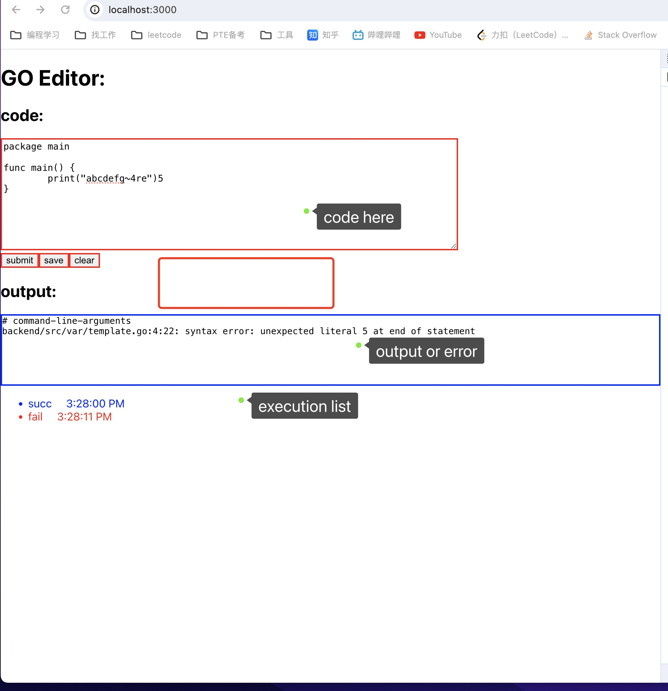

# GoEditor

## features:
- Online go editor for the single file Golang program
- You can submit, save, clear your code snippets
- There is a list for recording the result and time of each code execution
- You can see the result for your code for both cases in success or failure

## display


- `submit` button: submit your code snippet to the backend api
- `save` button: save your code, you can keep your code even if you refresh your browser
- `clear` button: clear your code, you can clear your code in one button
##  deployment

### method1:
- run backend part locally:

```shell
# go to dir and run
cd backend
go run main.go
```
the backend server will be run on: http://localhost:8080
- run frontend part locally:
```shell
# go to dir and run
cd frontend
npm install
npm start
```

the frontend server will be run on: http://localhost:3000

Then you can access GoEditor at: http://localhost:3000/

### method2:
- run locally by using docker
```shell
# get latest image from docker hub
docker pull hsbzzhz/go-editor
docker run -it hsbzzhz/go-editor -p 9090:8080
```

then you can visit at: http://localhost:9090/

